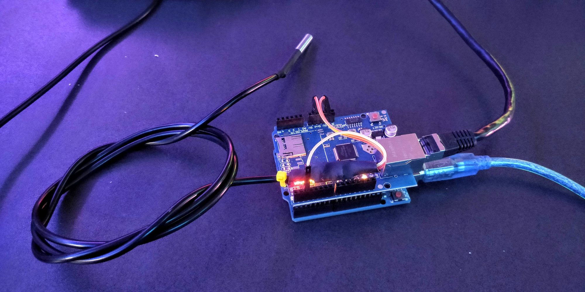

# arduino-temp-exporter 

Use an Arduino Uno, an Ethernet shield and a temperature sensor as a exporter for Prometheus.

## Hardware list
  * Arduino Uno
  * W5100 ethernet shield
  * DS18B20 temperature sensor

## Network configuration
Modify the `src/main.cpp` file and set `STATIC` to 1 or 0 depending if you want a static IP or DHCP.

## Installation
This project was intendet to be build and flashed with [Platformio](https://platformio.org/). When you have it
installed you can run `platformio run` to get all dependencies and `platformio run -t upload` to compile&uploda to your Arduino
